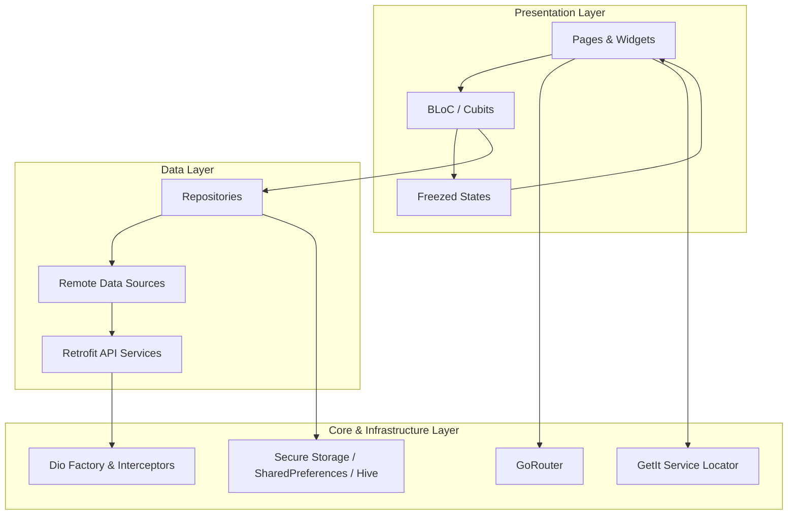
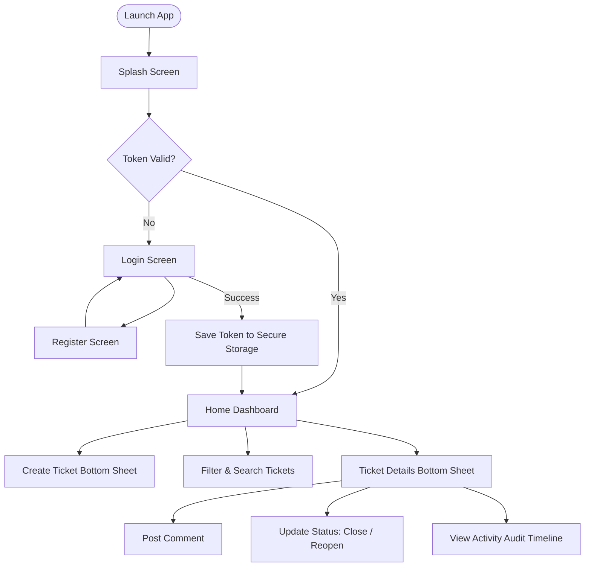
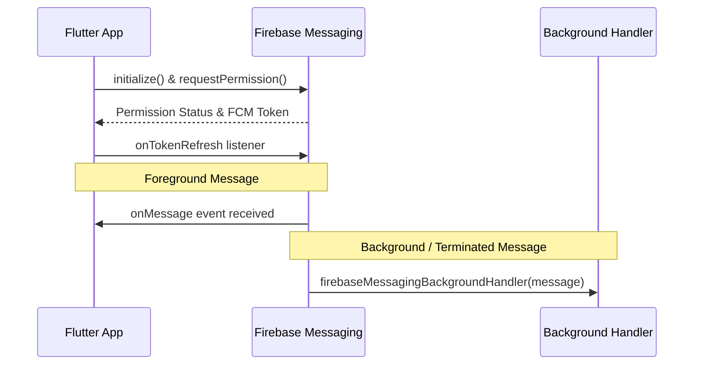

# One Support

[](https://flutter.dev)
[](https://dart.dev)
[](https://flutter.dev)
[](https://bloclibrary.dev)
[](LICENSE)

One Support is a customer support and ticket management mobile application built with Flutter. It provides a structured platform for users to submit issues, track ticket progress, communicate with support agents, and review ticket activity histories.

---

## Table of Contents

- [1. Project Overview](#1-project-overview)
- [2. Features](#2-features)
- [3. Architecture](#3-architecture)
- [4. Tech Stack](#4-tech-stack)
- [5. Project Structure](#5-project-structure)
- [6. Getting Started](#6-getting-started)
- [7. Configuration](#7-configuration)
- [8. Application Flow](#8-application-flow)
- [9. User Roles](#9-user-roles)
- [10. Notification System](#10-notification-system)
- [11. State Management](#11-state-management)
- [12. Networking](#12-networking)
- [13. Storage](#13-storage)
- [14. Screenshots](#14-screenshots)
- [15. Contributing](#15-contributing)
- [16. Future Improvements](#16-future-improvements)
- [17. License](#17-license)
- [18. Author](#18-author)

---

## 1. Project Overview

One Support streamlines issue tracking and resolution between end-users and support teams. The application delivers:

- Secure user authentication and session persistence.
- Ticket creation, lifecycle tracking, search, and filtering.
- Communication threads via ticket comments.
- Complete audit trails displaying ticket activity history.
- Bilingual localization (English and Arabic) with dynamic RTL and LTR support.
- Adaptive theming supporting Material 3 Light and Dark modes.

---

## 2. Features

- **Authentication**: User registration and login with form validations, token persistence, and "Remember Me" capability.
- **Ticket Dashboard**: Overview metrics displaying counts for total, open, in-progress, and resolved tickets.
- **Ticket Management**: Create support requests with defined priorities (`Low`, `Medium`, `High`, `Critical`).
- **Search and Filtering**: Real-time ticket search by title or description, filtered by status and priority.
- **Ticket Details**: Detailed sheet displaying ticket metadata, status actions, comment feed, and audit timeline.
- **Ticket Comments**: Post and view chronological comments on tickets.
- **Activity Timeline**: Chronological event logs for status transitions and assignments.
- **Internationalization (i18n)**: English and Arabic language support with persisted user preferences.
- **Theming**: Dynamic Light and Dark modes powered by Material 3 color schemes.
- **Push Notifications**: Firebase Cloud Messaging setup for background and foreground notifications.

---

## 3. Architecture

The project follows a **Feature-First Clean Architecture** pattern. This structure ensures clear separation of concerns, high testability, and modularity.



- **Presentation Layer**: UI widgets, screens, and BLoC/Cubit state handlers.
- **Data Layer**: Data sources, DTOs (`json_serializable`), and repository implementations.
- **Core Layer**: Shared utilities, networking clients, local storage engines, dependency injection, routing, and theming.

---

## 4. Tech Stack

| Category | Technology / Package | Version | Purpose |
| :--- | :--- | :--- | :--- |
| **Framework** | Flutter | ^3.10.8 | Cross-platform application framework |
| **Language** | Dart | ^3.10.8 | Core programming language |
| **State Management** | flutter_bloc | ^9.1.1 | Predictable state container |
| **Networking** | Dio / Retrofit | ^5.11.1 / ^4.10.0 | REST client and type-safe API generation |
| **Routing** | go_router | ^18.0.1 | Declarative URL-based routing |
| **Dependency Injection** | get_it | ^9.2.1 | Service locator for inversion of control |
| **Data Immutability** | freezed / json_annotation | ^4.0.1 / ^4.12.0 | Immutable states and JSON model serialization |
| **Secure Storage** | flutter_secure_storage | ^11.1.1 | Encrypted storage for authentication tokens |
| **Key-Value Storage** | shared_preferences | ^2.5.5 | User settings and preferences storage |
| **Cache Engine** | hive_ce / hive_ce_flutter | ^2.20.0 / ^2.3.4 | Local high-performance NoSQL box caching |
| **Push Notifications** | firebase_messaging | ^16.7.0 | Firebase cloud notifications delivery |
| **Logging** | pretty_dio_logger | ^1.4.0 | Formatted network traffic logging |

---

## 5. Project Structure

```
lib/
├── core/
│   ├── di/                 # Dependency injection container setup (GetIt)
│   ├── helpers/            # Input validators, extensions, UI spacing helpers
│   ├── localization/       # ARB translation files, delegates, and LocalizationCubit
│   ├── networking/         # Dio client, API endpoints, error handler, ApiResult
│   ├── routing/            # GoRouter configuration and route definitions
│   ├── services/           # Firebase messaging service implementations
│   ├── storage/            # Secure storage, preferences, and Hive cache abstractions
│   ├── theme/              # Color schemes, ThemeData, and ThemeCubit
│   └── widgets/            # Globally shared UI components (buttons, text fields)
├── features/
│   ├── auth/
│   │   ├── login/          # Login data sources, repository, Cubit, and pages
│   │   └── register/       # Register data sources, repository, Cubit, and pages
│   ├── home/
│   │   ├── data/           # Ticket APIs, response models, and HomeRepository
│   │   └── presentation/   # Dashboard, filters, lists, ticket details, and bottom sheets
│   └── splash/             # Startup splash screen and session validation
├── firebase_options.dart   # Firebase CLI generated configuration
├── main.dart               # Main entry point and background messaging setup
└── one_support_app.dart    # Root MaterialApp configuration
```

---

## 6. Getting Started

### Prerequisites

- Flutter SDK version `>= 3.10.8`
- Dart SDK version `>= 3.10.8`
- Android Studio / VS Code with Flutter extensions
- Android SDK or Xcode (for iOS builds)

### Installation Steps

1. Clone the repository:
   ```bash
   git clone https://github.com/your-username/one_support.git
   cd one_support
   ```

2. Install dependencies:
   ```bash
   flutter pub get
   ```

3. Run code generation:
   ```bash
   flutter pub run build_runner build --delete-conflicting-outputs
   ```

4. Run the application:
   ```bash
   flutter run
   ```

---

## 7. Configuration

### Backend Base URL
The backend API base URL is configured in `lib/core/networking/api_endpoints.dart`:

```dart
abstract final class ApiEndpoints {
  static const String baseUrl = 'https://support-ticket.runasp.net/';
  static const String login = 'api/v1/Account/login';
  static const String register = 'api/v1/Account/register';
  static const String tickets = '/api/v1/tickets';
}
```

### Firebase Setup
1. Ensure the Firebase CLI and FlutterFire CLI are installed.
2. Run configuration to generate platform-specific settings:
   ```bash
   flutterfire configure
   ```
3. Verify that `firebase_options.dart` contains valid app credentials.

---

## 8. Application Flow



---

## 9. User Roles

The system recognizes three primary roles based on backend authentication:

| Role | Scope | Permissions |
| :--- | :--- | :--- |
| **Customer** | Own Resources | Can create support tickets, view personal tickets, post comments, and close/reopen their own tickets. |
| **Support Agent** | Assigned Tickets | Can view assigned tickets, respond via comments, and mark tickets as resolved. |
| **Admin** | Global System | Can view all system tickets, assign agents, and update tickets to any lifecycle status. |

---

## 10. Notification System

Push notifications are powered by **Firebase Cloud Messaging (FCM)** via `FirebaseMessagingService`.



- **Permission Handling**: Automatically requests notification permissions on startup.
- **Background Execution**: Background messages are processed via `@pragma('vm:entry-point')` in `main.dart`.
- **Token Management**: Exposes `getToken()` and `onTokenRefresh` streams for backend synchronization.

---

## 11. State Management

The application utilizes **BLoC / Cubit** (`flutter_bloc`) paired with **Freezed** for union state declarations:

- `SplashCubit`: Manages initial session checks and routing.
- `LoginCubit`: Handles login form validation, network submission, and token caching.
- `RegisterCubit`: Manages user registration requests and form state.
- `HomeCubit`: Controls ticket fetching, pagination, filter state, ticket creation, comments, and status modifications.
- `ThemeCubit`: Manages dynamic switching between Light and Dark themes and persists preferences.
- `LocalizationCubit`: Controls dynamic language switching between English and Arabic and persists preferences.

---

## 12. Networking

The networking layer is built on **Dio** and **Retrofit**:

- **Singleton Dio Client**: Configured in `DioFactory` with timeouts and JSON content headers.
- **Logging Interceptor**: `PrettyDioLogger` logs headers, request bodies, and responses during debug mode.
- **Authorization**: Dynamic bearer token injection via `DioFactory.setTokenIntoHeaderAfterLogin(token)`.
- **Typed Error Handling**: Network responses are wrapped in `ApiResult<T>`, returning either `Success(data)` or `Failure(ErrorHandler)`.

---

## 13. Storage

The application implements a multi-tier local storage strategy:

```
┌─────────────────────────────────────────────────────────────┐
│                       Storage Strategy                      │
├──────────────────────────┬──────────────────────────────────┤
│ flutter_secure_storage   │ JWT Access Tokens & Credentials  │
├──────────────────────────┼──────────────────────────────────┤
│ shared_preferences       │ Theme Mode, Language, Remember Me│
├──────────────────────────┼──────────────────────────────────┤
│ hive_ce                  │ High-Performance NoSQL Caching  │
└──────────────────────────┴──────────────────────────────────┘
```

- **`SecureStorageService`**: Persists sensitive authorization tokens securely.
- **`PreferencesService`**: Stores user settings, UI states, and theme/language preferences.
- **`CacheService`**: Provides structured key-value box storage for offline data caching using Hive Community Edition.

---

## 14. Screenshots

> Place application screenshots in an `assets/screenshots/` directory.

| Login Screen | Tickets Dashboard | Ticket Details |
| :---: | :---: | :---: |
| *(Screenshot Placeholder)* | *(Screenshot Placeholder)* | *(Screenshot Placeholder)* |

| Create Ticket | Activity Timeline | Dark Mode Overview |
| :---: | :---: | :---: |
| *(Screenshot Placeholder)* | *(Screenshot Placeholder)* | *(Screenshot Placeholder)* |

---

## 15. Contributing

1. Fork the repository.
2. Create a feature branch:
   ```bash
   git checkout -b feature/your-feature-name
   ```
3. Commit your changes following Conventional Commits:
   ```bash
   git commit -m "feat: add support ticket priority indicator"
   ```
4. Push to your branch:
   ```bash
   git push origin feature/your-feature-name
   ```
5. Open a Pull Request.

---

## 16. Future Improvements

- File and image attachment uploads for tickets and comments.
- Real-time WebSocket support for live ticket comment streaming.
- Full offline synchronization mode with automatic retry queues.
- Biometric authentication (Fingerprint / Face ID).
- In-app push notification inbox and preference management.

---

## 17. License

This project is licensed under the MIT License. See the [LICENSE](LICENSE) file for details.

---

## 18. Author

**Ahmed Hosny**  
EraaSoft Flutter Development Team  
GitHub: [@a7medhosny](https://github.com/a7medhosny)

